# 版本控制

> **版本控制（ Revision control ）** 是一种记录一个或若干文件内容变化，以便将来查阅特定版本修订情况的系统

## 本地版本控制


本地版本控制主要分为两种类型

1. 复制整个项目目录以保存不同的版本，或许还会加上备份时间以示区别

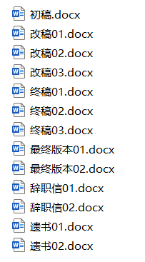

- 如 ~~**从入门到入土**~~

2. 采用某种简单的数据库来记录文件的历次更新差异

- 如 **RCS** ，其工作原理是在硬盘上保存补丁集（补丁是指文件修订前后的变化）；通过应用所有的补丁，可以重新计算出各个版本的文件内容

## 集中化版本控制

**集中化的版本控制系统（ Centralized Version Control Systems ， CVCS ）**让不同系统上的开发者协同工作，如 **CVS** 、 **Subversion** 、 **Perforce**


这类系统有如下特征：

1. 有一个单一的集中管理的服务器，保存所有文件的修订版本

2. 协同工作者通过客户端连到中央服务器，取出最新的文件或者提交更新

相比本地 VCS ，其有显著优势：

1. 每位工作者都可以在一定程度上了解项目中其他人的行为

2. 管理员可以轻松掌控每个工作者的权限

3. 管理一个 CVCS 远比在各个客户端上维护本地数据库轻松容易

然而其劣势也显而易见，即**中央服务器的单点故障**

若中央服务器宕机，那么所有工作者在宕机时间段内都无法取出或更新文件，从而无法协同工作；若中央服务器的储存硬件损坏，又没有进行相应的备份，那么所有数据及其变更历史都将丢失，只剩下工作者在各自机器上保留的单独快照

本地版本控制也有着类似问题

## 分布式版本控制

**分布式版本控制系统（ Distributed Version Control System ， DVCS ）**的面世解决了这一问题，如 **Git** 、 **Mercurial** 、 **Bazaar** 、 **Darcs** 

这类系统中，客户端并不只提取最新版本的文件快照， 而是把代码仓库完整地镜像下来，包括完整的历史记录，每一次的镜像操作，实际上都是一次对代码仓库的完整备份

这样，任何一处协同工作用的服务器发生故障，都可以用任何一个镜像出来的本地仓库恢复

# Git 趣史

同生活中的许多伟大事物一样， Git 诞生于一个极富纷争大举创新的年代。

Linux 内核开源项目有着为数众多的参与者。 绝大多数的 Linux 内核维护工作都花在了提交补丁和保存归档的繁琐事务上（ 1991~2002 ）

到 2002 年，整个项目组开始启用一个专有的分布式版本控制系统 BitKeeper 来管理和维护代码

到了 2005 年，开发 BitKeeper 的商业公司同 Linux 内核开源社区的合作关系结束，他们收回了 Linux 内核社区免费使用 BitKeeper 的权力（~~没人会告诉你是因为 Linux 开发者们对 BitKeeper 系统的破解与修改~~）

这迫使 Linux 开源社区（特别是 Linux 的缔造者 **Linus Torvalds** ）基于使用 BitKeeper 时的经验教训，开发出自己的版本系统，即 **Git**

值得一提的是， **Linus Torvalds** 仅用**一周多时间**便独自开发出 Git 的初代版本

# Git 思想及工作原理

## 直接记录快照

Git 和其它版本控制系统的主要差别在于 Git 对待数据的方式

**其它大部分系统以文件变更列表的方式存储信息**，这类系统将它们存储的信息看作是一组基本文件和每个文件随时间逐步累积的差异，被称作**基于差异（ delta-based ）**的版本控制


**Git 对待数据更像是一个快照流**，即储存项目随时间改变的快照

每当你提交更新或保存项目状态时，它就会对当时的全部文件创建一个快照并保存这个快照的索引。

为了效率，如果文件没有修改，它便不再重新存储该文件，而是只保留一个链接指向之前存储的文件。


## 本地执行大部分操作

在 Git 中的绝大多数操作都只需要访问本地文件和资源，而很少需要来自网络上其它计算机的信息，因为你在本地磁盘上就有项目的完整数据和历史变更

这意味着即使在离线状态下，你也几乎可以进行任何操作，并在有网络连接时再将文件上传

## 保证数据完整性

Git 中所有的数据在存储前都计算**校验和**，然后以**校验和**来引用

其用以计算**校验和**的机制叫做 **SHA-1 散列（ hash ，即哈希）**

这是一个由 **40 个十六进制字符（ 0~9 和 a~f ）**组成的字符串，基于 Git 中文件的内容或目录结构计算出来

实际上， Git 数据库中保存的信息都是以**文件内容的哈希值**来索引，而不是文件名

## 一般只添加数据

Git 几乎不会执行任何可能导致文件不可恢复的操作

你执行的 Git 操作，几乎只往 Git 数据库中**添加**数据，而很难使用 Git 从数据库中删除数据

因此，我们可以使用 Git ~~**随便搞**~~，而且不容易寄

# 安装并配置 Git

## 安装 Git

进入[ Git 官网下载](https://git-scm.com/downloads)下载对应操作系统的 Git 安装包

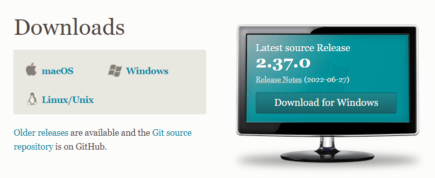

若官网下载太慢，我们可以使用[淘宝镜像下载](http://npm.taobao.org/mirrors/git-for-windows/)

安装时，无脑下一步即可

## 更新 Git

若你已经安装过 Git ，可以通过运行如下如下更新到最新版本

```
git clone https://github.com/git/git
```

## 启动 Git

安装成功后，打开开始菜单中的 **Git** 文件夹我们可以看到如下三个程序


> Git Bash ： Unix 与 Linux 风格的命令行 **(推荐)**
> 
> Git CMD ： Windows 风格的命令行
> 
> Git GUI ：图形界面的 Git 

在任意文件夹中点击右键也可以看到如下图对应程序

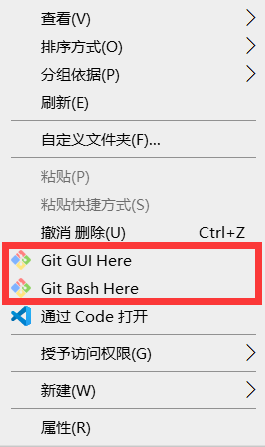

## 查看 Git 配置

运行如下任一命令以查看 Git 配置

```
git config --list

git config -l
```

会反馈如下图所示信息

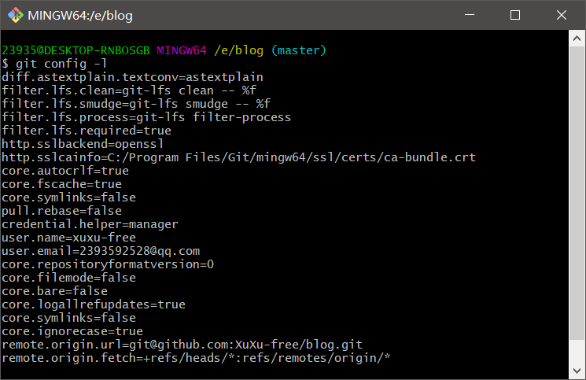

运行以下命令以查看不同级别的配置

```
#查看系统(system)配置
git config --system --list

#查看当前用户(global)配置
git config --global --list
```

结果分别如下

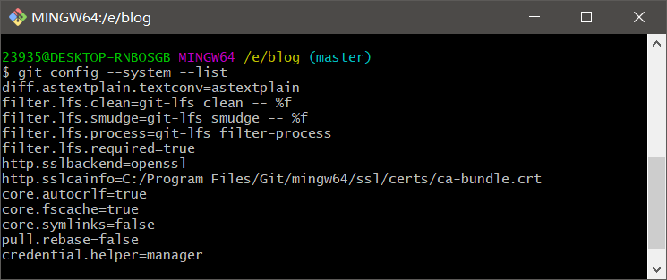

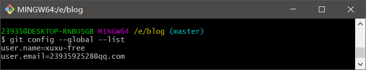

事实上，当前用户配置信息储存在当前用户主目录下 ```C:\Users\Administrator\.gitconfig``` 中，如下图

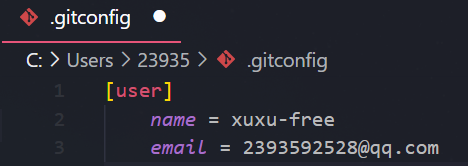

系统配置信息储存在 Git 安装目录下 ```C:\Program Files\Git\etc\gitconfig``` 中，如下图

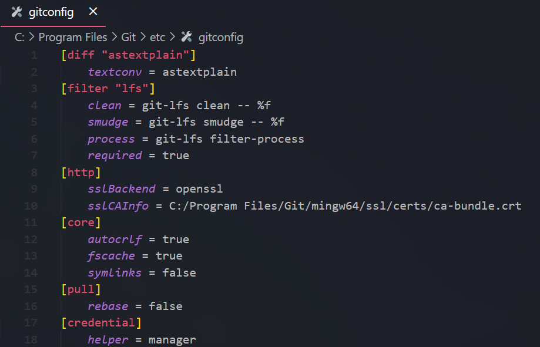

## 配置用户名与邮箱

运行以下命令以配置用户名与邮箱

```
#配置用户名
git config --global user.name "name"  

#配置邮箱
git config --global user.email e-mail
```

其中 ```--global``` 表示在全局进行配置

如果你希望在一个特定的项目中使用不同的用户名或邮箱，你可以在该项目中运行不包含 ```--global``` 选项的对应命令

# Git 的基本工作流程

1. 在工作区中**添加或修改**文件

2. 将想要提交的更改选择性地添加到**暂存区**

3. 找到**暂存区**中的想要提交的更改，将快照存储到 **Git** 目录


# 获取Git仓库

通常有两种获取 Git 项目仓库的方式：

1. 将尚未进行版本控制的本地目录转换为 Git 仓库

2. 从其它服务器**克隆**一个已存在的 Git 仓库

## 在已存在目录中初始化仓库

若你有一个尚未进行版本控制的项目目录，并想要用 Git 来控制它，就需要在该目录下启动 Git ，并运行如下命令

```
git init
```

结果如下


该命令将创建一个名为 ```.git``` 的子目录（在 Windows 环境为一隐藏文件夹），这个子目录含有你初始化的 Git 仓库中所有的必须文件

## 克隆现有的仓库

若你想获得一份已经存在了的 Git 仓库的拷贝，则需要在该目录下启动 Git ，并运行如下命令

```
git clone <url>
```

这会在当前目录下创建一个对应的项目目录，并在这个目录下初始化一个 ```.git``` 文件夹，从远程仓库拉取下所有数据放入 ```.git``` 文件夹，然后从中读取最新版本的文件的拷贝 


若你想在克隆远程仓库的时候，自定义本地仓库的名字，你可以通过额外的参数指定新的目录名

```
git clone <url> dirname
```

Git 支持如下多种数据传输协议
- ```https://``` 协议
- ```git://``` 协议
- ```SSH``` 传输协议（如 ```user@server:path/to/repo.git``` ）


# Git 文件操作

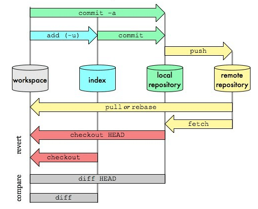

## 工作区域

 Git 本地有三个工作区域

- **工作目录（ Working Directory ）** ：本地存放项目文件的目录

- **暂存区( Stage / Index )** ：临时存放改动，只是一个**文件**，用于保存即将提交到文件列表信息

- **本地仓库( Repository / Git Directory )** ：安全存放数据的区域，包含你提交到所有版本的数据。其中 **HEAD** 指向最新放入仓库的版本
 
如果在加上远程的 Git 仓库就可以分为四个工作区域

- **远程仓库( Remote Directory )** ：用于托管代码的服务器

## 文件状态及操作

### 查看文件详细状态

运行如下命令可以查看文件状态

```
#查看指定文件状态
git status <files>

#查看所有文件状态
git status
```

### Git 文件状态及简单文件操作

下图对几种文件状态及转化进行了总结


- **Untracked** : 文件未被跟踪，即未进入版本控制，如下图中的 ```test.txt``` 文件
    
    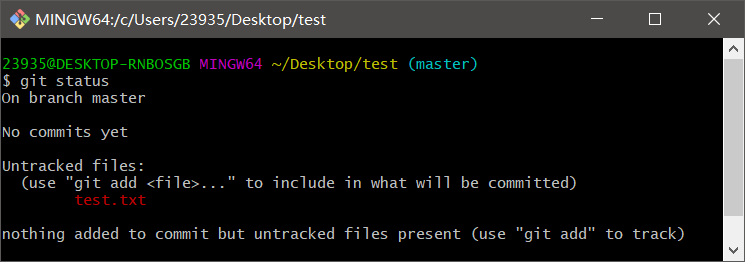

    此时可以使用 ```git add <files>``` 命令，将文件放入暂存区，使其进入版本控制，变为 ```staged``` 

    > 值得注意的是， ```git add``` 命令使用文件或目录的路径作为参数，若参数是目录的路径，该命令将递归地跟踪该目录下的所有文件
    >
    >如 ```git add .``` 命令，可以讲工作目录中所有文件放入暂存区，变为 ```staged```

- **Unmodified** ：文件已经被跟踪，但版本库中的文件快照与工作目录中的文件完全一致 
    
    这种类型的文件有两种去处
    
    - 若被修改, 而变为 ```Modified``` 
    
    - 若使用 ```git rm --cache <files>``` 移出版本控制, 则变为 ```Untracked```

- **Modified** ：已跟踪文件的内容发生了变化，但还没有放入暂存区，如下图中已被修改过的 ```test.txt``` 文件
    
    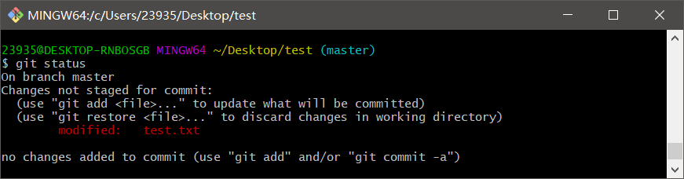

    此时可以使用 ```git add <file>``` 命令，将文件放入暂存区，变为 ```staged```

- **Staged** ：暂存状态，对一个新文件或已修改文件的当前版本做了标记，使之包含在下次提交的快照中

    此状态下的文件有两种来源：
    
    - 由 ```Untracked``` 文件进入暂存区
    
    - 由 ```Modified``` 文件进入暂存区

    如下图两个文件

    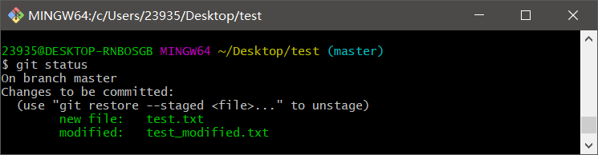

    可以使用 ```git commit -m "massage"``` 将文件转入本地仓库，使其变为 ```unmodified``` 


### 文件简览


使用```git status``` 命令的输出十分详细，但其用语有些繁琐，我们可以使用以下任一命令进行文件简览

```
git status -s

git status --short
```

新添加的未跟踪文件前面有 ```??``` 标记，新添加到暂存区中的文件前面有 ```A``` 标记，修改过的文件前面有 ```M``` 标记

输出中有两栏，左栏指明了暂存区的状态，右栏指明了工作区的状态

### 跳过暂存区域提交文件

使用暂存区域的方式有时略显繁琐

Git 提供了一个跳过使用暂存区域的方式，即运行命令 ```git commit -a``` , Git 就会自动把所有已经跟踪过的文件暂存起来一并提交，从而跳过 ```git add``` 步骤

### 移除文件

要从 Git 中移除某个文件，需要运行 ```git rm <file>``` 将目标文件从暂存区以及工作目录中移除，然后提交即可

需要注意的是，如果只是简单的在工作目录中使用 ```rm <file>``` 将文件删除，运行 ```git status``` 会得到如下结果

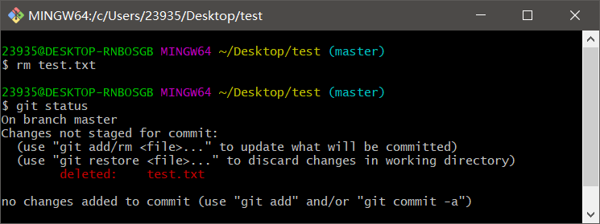

此时需要运行 ```git rm <file>``` 记录此次移除文件的操作，人后提交即可

如果要删除之前修改过或已经放到暂存区的文件，则必须添加强制删除选项，即 ```git rm <file> -f``` 或 ```git rm <file> --force```

这种特性用于防止误删尚未添加到快照的数据（这样的数据不能被 Git 恢复）

还有一种情况，我们想把文件从 Git 仓库中删除，但希望在工作目录中保存此文件，即让文件保留在磁盘，但是并不让 Git 继续跟踪

此时可以运行命令 ```git rm --cached <file>```

### 重命名文件

运行以下命令可以完成文件地重命名

```
git mv file_from file_to
```

事实上，如果在 Git 中重命名了某个文件，仓库中存储的元数据并不会体现出这是一次改名操作，不过 Git 可以自动识别发生了什么

其实，运行 ```git mv``` 就相当于运行了下面三条命令

```
mv README.md README
git rm README.md
git add README
```

不管何种方式结果都一样，而直接使用 ```git mv``` 更加方便

倘若使用其他工具重命名文件，**切记在提交前 ```git rm``` 删除旧文件名，再 ```git add``` 添加新文件名**，以免在仓库中保留重命名前的文件

## 撤销操作

### 修补最近的提交操作

```
git commit --amend
```

此命令会将暂存区中的文件提交，若自上次提交以来你还未做任何修改，那么快照会保持不变，而你所修改的只是提交信息

文本编辑器启动后，可以看到之前的提交信息，编辑后保存会覆盖原来的提交信息

> 修补最后的提交时，与其说是修复旧提交，倒不如说是完全用一个新的提交**替换**旧的提交，从效果上来说，就像是旧有的提交并不会出现在仓库的历史中

### 取消已暂存的文件

```
git reset HEAD <file>
```

运行此命令可以取消暂存指定文件

### 撤消对文件的修改

```
git checkout -- <file>
```

此命令会使目标文件在本地的任何修改消失，而 Git 会用最近提交的版本将其覆盖